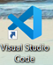
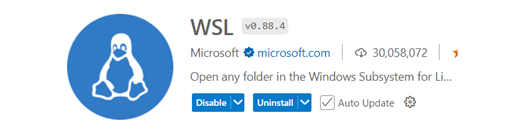
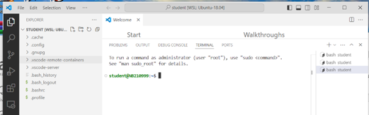

# Windows Subsystem for Lunix(WSL) Handleiding

## Introductie
Dit Handleiding beschrijft hoe je Linux/Ubuntu applicaties kunt ontwikkelen in Windows met gebruik van het Windows Subsystem for Linux(WSL) en Visual Code. Dit is een alternatieve werkwijze voor het gebruik van Docker. 

Er worden een aantal scenario’s beschreven:
* Ubuntu 18/20/22/24 WSL-native (dus zonder toegevoegde applicaties)
* Ubuntu 18.04 met ROS-Melodic integratie
* Ubuntu 22.04 met ROS-Humble integratie
* Ubuntu 24.04 met ROS-Fuzzy integratie

*p.s. Voor meer complexe applicaties welke bestaan uit onderling communicerende nodes/processen/containers wordt aanbevolen om Docker(DevContainers) te gebruiken. Docker valt buiten de scope van dit document.*

## Voorbereiden Windows voor WSL
Volg de volgende handelingen om WSL in Windows beschikbaar te maken
1.	Open in Windows het “Program and Features” control panel
2.	“Turn Windows features on or off” (rechter zijde control panel)
3.	Zet de volgende features aan:
    * Windows PowerShell 2.0
    * Windows Subsystem for Linux


## Installatie Visual Studio Code(VSC)
Volg de volgende handelingen om Visual Studio Code te installeren
* [Download VSC](https://code.visualstudio.com/download)
*   Installeer VSC door de gedownloade executable (t VSCodeUserSetup-x64-x.xx.x .exe) te starten
* Op de installatie het VSC programma


* Installer in VSC WSL support
* Open de Marketplace(extentions)


* Selecteer WSL


* Zorg ervoor dat in het linker paneel WSL geïnstalleerd is en ge-enabled


* Sluit VSC af


## Verkrijgen WSL distributie
* Ubuntu 18/20/22/24 WSL-native (dus zonder toegevoegde applicaties)
    * Gebruik de “Microsoft Store” om je gewenste distributie te downloaden
    * Ga naar “Apps”


* Zoek op “Ubuntu”
* Selecteer jou gewenste versie van Ubuntu en klik op “Installeer”
* Vervolg “Starten WSL Distributie(eerste keer)”

* De volgend distributies zijn al voor bereid en kun je downloaden vanaf: [Download link](https://avans.sharepoint.com/:f:/s/AEI-ROS-Robot-Operating-System0841/EkgcaYeGy_FGsrzQs9fWtX4BNBZvwPBGhUFpGZ8FiGwpQA?e=rLT7Fa)
    * Ubuntu 18.04 met ROS-Melodic integratie
    * Ubuntu 22.04 met ROS-Humble integratie
    * Ubuntu 24.04 met ROS-Fuzzy integratie


::::{tab-set}

:::{tab-item} ROS-Melodic

*Ubuntu 18.04 met ROS-Melodic integratie*
* Download het Ubuntu-18.04-AvansRosMelodic.tar bestand op een voor jou bekende plaats (**&lt;jou locatie&gt;**).
* Start “PowerShell” (start-menu via Windows Start)
* Voor het volgende commando uit in Powershell
``` bash
wsl --import Ubuntu-18.04-AvansRosMelodic <drive>:/Ubuntu-18.04-AvansRosMelodic <jou locatie>/Ubuntu-18.04-AvansRosMelodic.tar
```
:::

:::{tab-item} ROS-Humble

*Ubuntu 22.04 met ROS-Humble integratie*
* Download het Ubuntu-22.04-AvansRosHumble.tar bestand op een voor jou bekende plaats (**&lt;jou locatie&gt;**).
* Voor het volgende commando uit in Powershell
```bash
wsl --import Ubuntu-22.04-AvansRosHumble <drive>:/Ubuntu-22.04-AvansRosHumble <jou locatie>/Ubuntu-22.04-AvansRosHumble.tar
```
*	Voor grote projecten is deze integratie ook beschikbaar in Docker. Zie: [Github link](https://github.com/AvansMechatronica/ROS2HumbleDevcontainer)
:::

:::{tab-item} ROS-Jazzy
*Ubuntu 24.04 met ROS-Jazzy integratie*
* Download het Ubuntu-24.04-AvansRosJazzy.tar bestand op een voor jou bekende plaats (**&lt;jou locatie&gt;**).
* Voor het volgende commando uit in Powershell
```bash
wsl --import Ubuntu-14.04-AvansRosJazzy <drive>:/Ubuntu-24.04-AvansRosJazzy <jou locatie>/Ubuntu-24.04-AvansRosJazzy.tar
```
* Voor grote projecten is deze integratie ook beschikbaar in Docker. Zie: [Github link](https://github.com/AvansMechatronica/ROS2JazzyDevcontainer.git)
:::

::::


## Starten WSL Distributie(eerste keer)
*Opmerking: Deze stap kan worden overgeslagen bij de voor geconfigureerde distributies van Avans*
* Vanuit de “Microsoft Store” beweeg je je muis over de geïnstalleerde distributie


* Klik met je muis op Open/Openen
* Voer een gebruikersnaam(zelf bedacht, in kleine letters) in, wanneer daarom wordt gevraagd
* Voer een wachtwoord(2x) in wanneer daarom wordt gevraagd (onthoud dit wachtwoord).
* Wacht op de melding “Installation successful!”
* Sluit de terminal af met het “logout” commando.


## Starten WSL Distributie vanuit Visual Code
Voer de volgende handelingen uit om de WSL-distributie te openen in Visual Studie Code om van daaruit je linux/applicatie te ontwikkelen
* Start VSC
* Open de Command Palette door de toets F1
* Type in de Command Pallette WSL
* Selecteer “WSL: Connect WSL using distro…” en selecteer jou geïnstalleerde WSL distributie
* Open een terminal
    * Menu van VSC; TerminalNew Terminal
    * Toet combinatie “Shift”+ “Ctrl” +”`”
    * *Opmerking: je kunt meerdere terminals gelijktijdig openen, een lijst van geopende terminals vind je aan de linker zijde van het terminal-paneel*
* Open de bestands verkenner
    * Open het bestandsverkenner(Explorer) met het volgende icoon


    * Kies open Folder, select
        * /home/student/
        * /home/<mijn gebruikersnaam>
* De layout van VSC ziet er dan als volgt uit


* De volgende gegevens zijn van belang bij het inloggen van een voor geconfigureerde distributie
    * Gebruikersnaam: student
    * Wachtwoord: Geheim! (gebruik dit wachtwoord ook bij sudo opdrachten)

## Applicatie ontwikkeling
Je kunt nu applicaties in Python/C/C++/Java etc. ontwikkelen. Je dient echter wel in de distributie eerst  de juiste programma’s/compilers/bibliotheken daarvoor te installeren. Je kunt dit doen met het Linux “apt” commando of voor b.v. Python-bibliotheken met het “pip” of “pip3” commando. 

## Koppelen USB-devices aan WSL-Distributie
Als je USB devices wilt gebruiken in je WSL-distributie dan moeten deze worden “geforward” van windows naar WSL. Hiervoor is de grafische WSL-USB tool beschikbaar.
Voer de volgende handelingen uit:
* Download het “WSL-USB-x.x.x.msi” bestand van [Download link](https://gitlab.com/alelec/wsl-usb-gui/-/releases)
* Installeer het WSL-USB programma met het gedownload bestand.
* Start het volgende programma
```bash
C:\Program Files\WSL USB\ wsl-usb-gui.exe
```
*Opmerking: helaas is dit niet beschikbaar via het Windows start-menu(je kun wel een snelkoppeling maken naar je desktop)*
* Volg de instructies op om een USB device te forwarden op de [website](https://gitlab.com/alelec/wsl-usb-gui)
 * Afhankelijk van jou computer/Windows systeemconfiguratie kan meerdere malen gevraagd worden om je Windows gebruikersnaam en wachtwoord in te voeren 
* Tip: Je kunt de connectie automatisch laten plaatvinden door de **“Auto-Attach”** functie
 * Device: Het aangesloten type apparaat op één van de USB poorten wordt met WSL verbonden(Attach), dit is de meest geschikte wijze voor de meeste USB apparaten
 * Port: Een willekeurig apparaat op een specifieke (fysieke)USB-poort wordt met WSL verbonden(Attach). Gebruik deze methode voor b.v. een OAK depthAI camera, maar houd er dan rekening mee dat deze camera dan altijd op dezelfde fysieke USB poort aangesloten dient te worden.
 * Vergeet een apparaat of USB-poort te verbreken(Detach) als je het USB apparaat weer onder Windows wilt gebruiken.
* Let op: het e.a. kan niet goed werken als TCP port 3240 door de Firewall wordt geblokkeerd (zoek op internet naar een oplossing)

## Valkuilen
De volgende valkuilen zijn bekend bij het gebruik van een WSL distributie
* Als je een distributie “unregister” met het “wsl –unregister” commando ben je al je bestanden/instellingen/geïnstalleerde programma’s kwijt die in de distributie zijn aangemaakt .
 * Je kunt je bestanden in de distributie kopiëren met de VSC omgeving doormiddel van copy & past. Beter is om een GIT-repository aan te maken/gebruiken voor je eigen bestanden
* Er volgen nog meer….

Referenties
Op de volgende websites kun je meer informatie vinden
* [VSC](https://code.visualstudio.com/)
* [WSL 1](https://learn.microsoft.com/en-us/windows/wsl/install)
* [WSL 1](https://learn.microsoft.com/nl-nl/windows/wsl/about)
* [WSL-Cheat sheet](./WSL_Cheatsheat.md)
* [Ubuntu](https://ubuntu.com/desktop/wsl)
 
## Overige opmerkingen/Aandachtspunten
### Platform IO
Platform IO kan worden toegevoegd  worden VSC. Ga daarvoor naar de VSC marketplace(extentions) en zoek op PlatformIO
* Het installeren en het voor de eerste keer openen van en PlatformIO project neemt enige tijd in beslag, heb geduld. Wanneer het e.a. goed is opgestart blijkt daarna het e.a. op normale “snelheid” te lopen.

